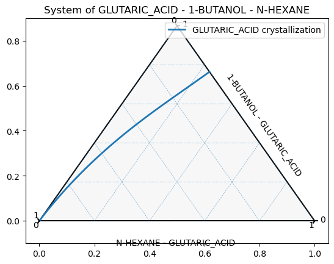

# Antisolvent Screening for Drowning-Out Crystallization Based on COSMO calculation

## About

* This repository includes python scripts used for the screening of antisolvent when designing a drowing-out crystallization system.
* The methodology for the screening process is developed by **Molecular Design Lab** of the Department of Chemical and Biological Engineering of Korea University.
    * ***(Nov, 2023) Literature for the methodology has not been published yet.***
* The methodology uses activity coefficients calculated with COSMO-SAC. The user-defined module <code>cosmosac2</code> was used, which is a modified and upgraded version of the COSMO-SAC calculation module developed by **Beom Chan Ryu** of **Molecular Design Lab**.
  * Check out the literature for further information about the module: [Link](https://link.springer.com/article/10.1007/s10765-022-03141-7)

## About the codes
### ternary_calculate
* <code>ternary_calculate</code> is a module for calculating the composition of ternary solid-liquid equilibrium (SLE) of a solute-solvent-antisolvent system.
* A system is defined in the module by adding the components with their physical properties: (1) melting temperature, (2) heat of fusion, cosmo file and name respectively.
* The mole fraction of the solute is calculated iteratively based on the solid-liquid phase equation: $$ln(x_i\gamma_i)=\frac{-\Delta H_i^{fus}}{R}\left(\frac{1}{T}-\frac{1}{T_{m,i}}\right)$$
* Calculation results can be plotted on a ternary diagram using <code>plot_ternary</code> method.
    * The method uses the <code>ternay</code> python library: [python-ternary](https://github.com/marcharper/python-ternary)

### antisolvent_calculate
* <code>antisolvent_calculate</code> is a module for screening effective antisolvents.
* A system is defined and initiated from the <code>ternary_calculate</code> module.
* Solubility of the solute component is obtained based on the SLE calculation. It is then subtracted from the total amount of solute in the system to get the amount of precipitated solute.
* The calculation results can be plotted by <code>plot_antisolv</code> method to visualize the effectiveness of the antisolvent for the system.

 

